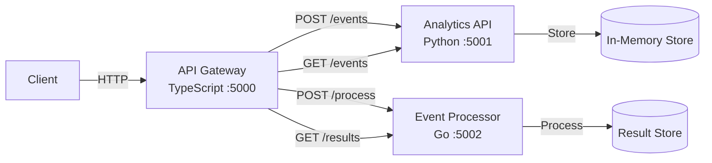

# PulseFlow

Real-time event processing platform built with a polyglot microservices architecture using Python, Go, and TypeScript.

## Architecture



## Services

| Service | Language | Port | Description |
|---------|----------|------|-------------|
| **API Gateway** | TypeScript (Express) | 5000 | Routes requests to backend services |
| **Analytics API** | Python (Flask) | 5001 | Ingests and queries events |
| **Event Processor** | Go (net/http) | 5002 | Processes events and stores results |

## Quick Start

### Prerequisites

- Docker & Docker Compose
- Python 3.12+, Go 1.22+, Node.js 20+ (for local development)

### Run with Docker Compose

```bash
cp .env.example .env
make up
```

### Verify services are running

```bash
make health
```

### Stop services

```bash
make down
```

## API Specification

### Gateway Endpoints (port 5000)

#### Health Check
```
GET /health
Response: {"status": "ok", "service": "api-gateway"}
```

#### Ingest Event
```
POST /api/events
Body: {"type": "click", "payload": {"x": 10, "y": 20}}
Response: {"event": {...}, "processing": {...}}
```

#### List Events
```
GET /api/events
GET /api/events?type=click
Response: [{"id": "...", "type": "click", ...}]
```

#### Event Statistics
```
GET /api/events/stats
Response: {"total": 42, "by_type": {"click": 30, "view": 12}}
```

#### Processing Results
```
GET /api/results
Response: [{"event_id": "...", "status": "processed", "processed_at": "..."}]
```

### Direct Service Endpoints

- **Analytics API** (port 5001): `/health`, `/events`, `/events/stats`
- **Event Processor** (port 5002): `/health`, `/process`, `/results`

## Usage Example

```bash
# Ingest an event
curl -X POST http://localhost:5000/api/events \
  -H "Content-Type: application/json" \
  -d '{"type": "page_view", "payload": {"url": "/home", "user": "u1"}}'

# List all events
curl http://localhost:5000/api/events

# Get stats
curl http://localhost:5000/api/events/stats

# Get processing results
curl http://localhost:5000/api/results
```

## Development

### Run Tests

```bash
make test
```

### Run Tests Individually

```bash
make test-python
make test-go
make test-ts
```

### Lint

```bash
make lint
```

## Environment Variables

| Variable | Default | Description |
|----------|---------|-------------|
| `GATEWAY_PORT` | `5000` | API Gateway port |
| `ANALYTICS_PORT` | `5001` | Analytics API port |
| `PROCESSOR_PORT` | `5002` | Event Processor port |
| `LOG_LEVEL` | `INFO` | Python service log level |
| `ANALYTICS_URL` | `http://localhost:5001` | Analytics API URL (for gateway) |
| `PROCESSOR_URL` | `http://localhost:5002` | Event Processor URL (for gateway) |

## CI/CD

GitHub Actions workflow runs on push to `main` and on pull requests:
1. Lint and test Python service
2. Vet and test Go service
3. Install and test TypeScript service
4. Build all Docker images

> **Note**: The `.github/workflows/ci.yml` file may need to be added manually after initial setup due to GitHub API restrictions on the `.github/` directory.

CI workflow contents are defined in `.github/workflows/ci.yml`.
